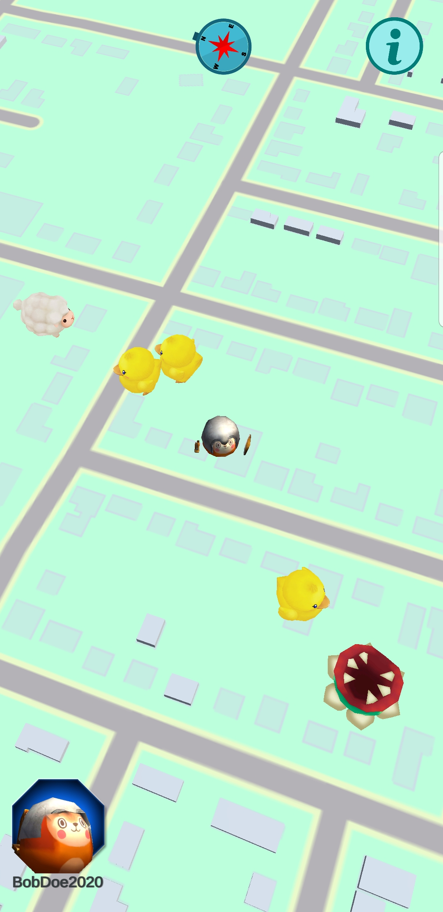
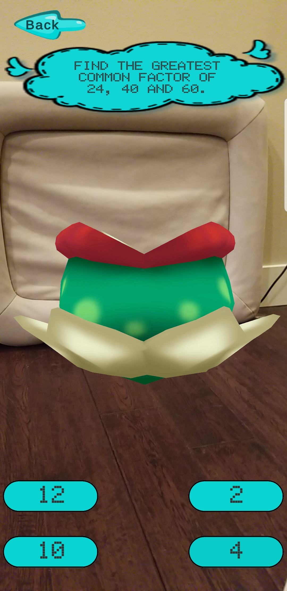
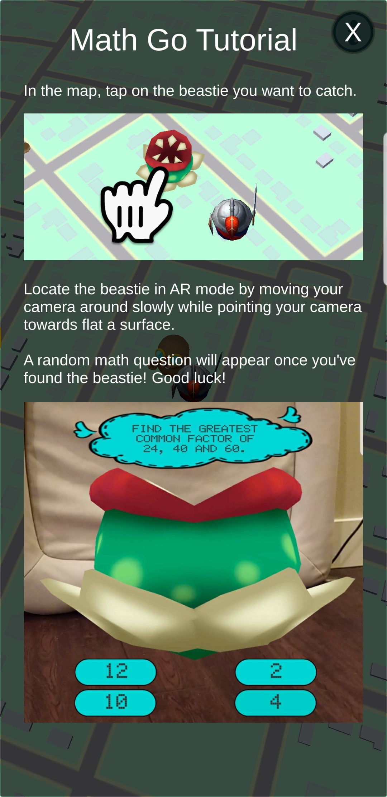

# Math Go!

The purpose of this project is to create an educational augmented reality (AR) mobile Android app for students studying math problems (difficulty level between grades K-8). Players can walk around in the real world and encounter beasties. To successfully capture a beastie, the player must solve a math problem correctly.

<p float="left" align="center">
  
  
  
  
</p>

## Building the Project
1. Clone this repository and cd into the project folder.
    ```
    git clone git@github.com:youncher/mathgo.git
    cd mathgo
    ```

2. Create the file `Assets/Resources/Mapbox/MapboxConfiguration.txt` with the content below, replacing the word in between the quotes with your Mapbox token. See [Mapbox Access Token](https://docs.mapbox.com/help/how-mapbox-works/access-tokens/).
    ```
    {
        "AccessToken": "Enter_MapBox_Access_Token",
        "MemoryCacheSize": 500,
        "FileCacheSize": 25000,
        "DefaultTimeout": 30,
        "AutoRefreshCache": false
    }
    ```
    
3. Inside of the Unity Editor, navigate to File>>Build Settings, and select the "Android" platform. Click "Switch Platform".
4. Generate a keystore file by going to Edit>>Project Settings>>Player>>Publishing Settings>>Keystore Manager. In the "Keystore Manager" window, click Keystore>Create New and select a location. Add an Alias and password.
5. Inside of Edit>>Project Settings>>Player>>Publishing Settings, check "Custom Keystore" and go to Select>>Browse to link your keystore file.
6. Input the keystore password in the password field.
7. For "Project Key", select your alias and enter the password.
8. Create the file ```Assets/Scripts/Key.cs``` with the content below, replacing the word in between the quotes with your [Google web client id](https://developers.google.com/fit/android/get-api-key#request_an_oauth_20_client_id_in_the).
    ```
    public class Keys
    {
        private static string webClientId = "Enter_Google_web_client_id";
        
        public static string GetWebClientId()
        {
            return webClientId;
        }
    }
    ```
9. After connecting a supported Android device, navigate to File>>Build and Run, select a filename for your apk and wait for Unity to build the game in your device.

## Math Go Backend
Please see https://github.com/youncher/mathgo-backend for the backend of Math Go.

## How to Use App
1. If permissions to ask for location appears on your device, tap on Allow.
2. After game has started, in the title screen, tap on “Sign On With Google” and login with your Google account.
3. On the new user registration page, tap on one of the character avatars and input your character’s name. Tap OK.
4. Confirm that you see the overworld map view with your character and Beasties spawned randomly around the map.
5. Tap on a Beastie, this will load the Capture Scene.
6. In the capture scene, if asked for permissions to take pictures or to record videos, tap Allow. Your camera will be activated.
7. Point your camera towards a flat surface within your area. You may need to move the camera slowly across different areas for the app to find a good surface to spawn a beastie. Once the beastie is spawned and your camera is facing the beastie, a random math question and potential answers will appear.
8. Tap the correct answer. If you’ve selected the correct answer, the screen displays “Correct”, otherwise, “Incorrect”. You are then taken back to the map view.

## Authors
* Cherie Young https://github.com/youncher
* Daniel Tran https://github.com/dtran550
* Jonathan Abantao https://github.com/jonabantao
